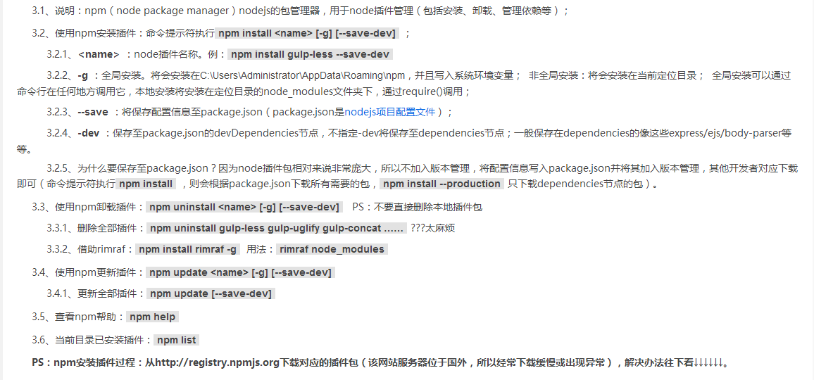

## 前端自动化构建环境的搭建

 **为了UED前端团队更好的协作开发同时提高项目编码质量，我们需要将Web前端使用工程化方式构建；**

 **目前需要一些简单的功能：**

      1. 压缩HTML
      2. 检查JS
      3. 编译SASS
      4. 压缩图片
      5. 压缩CSS
      6. 压缩JS
      7. 雪碧图制作
      8. 静态服务器
      9. 代理解决跨域
      10. 打包项目


**目前最知名的构建工具： Gulp、Grunt、NPM + Webpack；**

      grunt是前端工程化的先驱

      gulp更自然基于流的方式连接任务

      Webpack最年轻，擅长用于依赖管理，配置稍较复杂

PC端项目，我们推荐使用Gulp，Gulp基于nodejs中stream，工作流，效率更好语法更自然,不需要编写复杂的配置文件


**[演示项目](https://github.com/vincentSea/gulp-demo)**
```bash
顺手一下，star或者fork
```

### 初识 gulp

 **简介**

  gulp是前端开发过程中对代码进行构建的工具，是自动化项目的构建利器；她不仅能对网站资源进行优化，而且在开发过程中很多重复的任务能够使用正确的工具自动完成；使用她，我们不仅可以很愉快的编写代码，而且大大提高我们的工作效率。

  gulp是基于Nodejs的自动任务运行器， 她能自动化地完成 javascript/coffee/sass/less/html/image/css 等文件的的测试、检查、合并、压缩、格式化、浏览器自动刷新、部署文件生成，并监听文件在改动后重复指定的这些步骤。在实现上，她借鉴了Unix操作系统的管道（pipe）思想，前一级的输出，直接变成后一级的输入，使得在操作上非常简单。通过本文，我们将学习如何使用Gulp来改变开发流程，从而使开发更加快速高效。

  gulp 和 grunt 非常类似，但相比于 grunt 的频繁 IO 操作，gulp 的流操作，能更快地更便捷地完成构建工作。

 [Gulp 中文网站](http://www.gulpjs.com.cn/)

 [gulp详细入门教程](http://www.ydcss.com/archives/18) 


### Gulp使用

 Gulp是基于 Node.js的，需要要安装 Node.js


1. 为了确保依赖环境正确，我们先执行几个简单的命令检查。

    node -v
    Node是一个基于Chrome JavaScript V8引擎建立的一个解释器
    检测Node是否已经安装，如果正确安装的话你会看到所安装的Node的版本号

2. 接下来看看npm，它是 node 的包管理工具，可以利用它安装 gulp 所需的包

    npm -v
    这同样能得到npm的版本号，装 Node 时已经自动安装了npm

3. npm介绍

      


4. 开始安装Gulp

    npm install -g gulp
    全局安装 gulp

    gulp -v
    得到gulp的版本号，确认安装成功

基础安装结束


### 选装cnpm 

因为npm安装插件是从国外服务器下载，受网络影响大，这里建议使用cnpm

```bash
 npm install -g cnpm --registry=https://registry.npm.taobao.org
```

### cmd命令小技巧

```
创建空文件夹  mkdir name  name是文件夹名称
创建空文件    cd.> name.txt
删除文件夹    rd/s/q name name是文件夹名称 （物理删除）
tree命令     tree /f     显示树形结构
             tree /f > tree.txt    导出目录
```


### 集合功能
  - HTML组件化和压缩
  - 编译Sass和压缩css
  - 检查Javascript
  - 编译es6语法
  - 压缩Javascript
  - 无损压缩图片
  - 雪碧图制作
  - 创建静态服务器
  - 设置代理解决跨域
  - 打包项目且生成压缩包
  - 结合webpack使用（选用）


### 项目目录结构
```bash
│  .babelrc 
│  .eslintignore     // eslint文件过滤
│  .eslintrc         // eslint语法检查
│  .gitignore        // git文件过滤
│  config.js         // 路径配置文件
│  gulpfile.js       // gulp配置文件
│  package.json      // 依赖模块json文件,npm install会安装项目所有的依赖模块
│  README.MD         // 项目说明
│  webpack.config.js // webpack配置文件
│  
├─build              // 发布环境 和 预览环境
|
├─node_modules       // 依赖模块包目录
│      
└─src                // 开发环境项目
    │  index.html    // 启动默认页面
    │  
    ├─assets         // 静态资源
    │  ├─css         // 样式文件
    │  ├─images      // 图片文件
    │  ├─js          // js文件
    │  └─lib         // 插件文件
    │      
    └─page           // 页面文件
```

### gulpfile配置文件

#### 常用的插件
    gulp-sass:            sass的编译
    gulp-autoprefixer:    自动添加css前缀
    gulp-minify-css:      压缩css一行
    gulp-uglify:          压缩js代码
    gulp-notify:          加控制台文字描述用的
    gulp-clean:           清理文件
    gulp-file-include:    include 文件用
    gulp-imagemin:        图片压缩
    imagemin-pngquant:    图片无损压缩
    gulp-cache:           检测文件是否更改
    gulp-zip:             自动打包并按时间重命名
    gulp-htmlmin:         压缩html
    merge-stream:         合并多个 stream
    gulp-util:            打印日志 log
    gulp-plumber:         监控错误
    gulp-babel:           编译ES6
    gulp-if:              条件判断
    gulp-sequence:        顺序执行
    gulp-eslint:          代码风格检测工具
    del:                  删除文件


#### 制作雪碧图 (支持同时制作多个)
规定如下
1. 在src/assets/image中，sprite是作为需要制作雪碧图的文件夹
2. 在sprite文件夹下，必须新建一个文件夹，例如user文件夹，me文件，存放你的图标
3. 执行gulp sprites任务
4. 任务完成，在src/assets/image中就会生成一个icon文件夹，里面就是生成的雪碧图，在src/assets/css会生成雪碧图的scss样式文件

``` javascript
var srcDir = path.resolve(process.cwd(), config.sprite);
/**
 * 获取获取文件名字和路径
 * @returns 
 */
var iconFolder = function() {
    var filesSrc = []; // 文件路径
    var filesName = []; // 文件名字
    
    // 遍历获取文件名字和路径
    fs.readdirSync(srcDir).forEach(function(file, i){
        var reg = /\.(png|jpg|gif|ico)/g;
        var isImg = file.match(reg);

        // 判读是  file.indexOf('sprite') != -1
        if(!isImg){
            filesName.push(file);
            filesSrc.push(path.resolve(srcDir, file, '*.{png,jpg}'));
        }
    });
    // 返回文件名字和路径
    return {
        'name': filesName,
        'src' : filesSrc
    };;
}

/**
 * 
 * 支持多个文件夹编译生成雪碧图
 * 雪碧图制作规定要求
 * 在images文件夹下icon文件夹,新建一个文件夹就可以
 * 
 */
var csssPrites = function() {
    var folder = iconFolder();
    var folderName = folder.name;
    var folderSrc = folder.src;

    folderSrc.forEach(function (item, i) {
        var imgName = `images/icon/icon_${folderName[i]}.png`;
        var cssName = `css/icon_${folderName[i]}.scss`;

        return gulp.src(item) // 需要合并的图片地址
            .pipe(spritesmith({
                imgName: imgName, // 保存合并后图片的地址
                cssName: cssName, // 保存合并后对于css样式的地址
                padding: 10,  // 合并时两个图片的间距
                algorithm: 'binary-tree', // 注释1
                cssTemplate: './cssTemplate.tpl' // 模板
                // cssTemplate: function (data) {
                //     var arr=[];
                //     data.sprites.forEach(function (sprite) {
                //         arr.push(".icon-"+sprite.name+
                //         "{" +
                //         "background-image: url('"+sprite.escaped_image+"');"+
                //         "background-position: "+sprite.px.offset_x+"px "+sprite.px.offset_y+"px;"+
                //         "width:"+sprite.px.width+";"+
                //         "height:"+sprite.px.height+";"+
                //         "}\n");
                //     });
                //     return arr.join("");
                // }
            }))
            .pipe(gulp.dest('src/assets/'));
    })
}


/* 生成雪碧图 */ 
gulp.task('sprites', function () {
    // 执行任务
    csssPrites();
});

```


#### gulpfile.js内容
```javascript
//**
 * gulp 自动化构建工具
 * gulpfile.js 配置文件
 * 
 */
var fs            = require('fs');
var path          = require('path');

var gulp          = require('gulp');
var sass          = require('gulp-sass'); // sass的编译
var autoprefixer  = require('gulp-autoprefixer'); // 自动添加css前缀
var minifycss     = require('gulp-minify-css'); // 压缩css一行
var uglify        = require('gulp-uglify'); // 压缩js代码
var notify        = require('gulp-notify'); // 加控制台文字描述用的
var clean         = require('gulp-clean'); // 清理文件
var fileinclude   = require('gulp-file-include'); // include 文件用
var imagemin      = require('gulp-imagemin'); // 图片压缩
var pngquant      = require('imagemin-pngquant'); // 图片无损压缩
var cache         = require('gulp-cache'); // 检测文件是否更改
var zip           = require('gulp-zip'); // 自动打包并按时间重命名
var htmlmin       = require('gulp-htmlmin'); // 压缩html
var mergeStream   = require('merge-stream'); // 合并多个 stream
var gutil         = require('gulp-util'); // 打印日志 log
var plumber       = require('gulp-plumber'); // 监控错误
var babel         = require('gulp-babel'); // 编译ES6
var gulpif        = require('gulp-if'); // 条件判断
var minimist      = require('minimist');
var gulpSequence  = require('gulp-sequence'); // 顺序执行
var eslint        = require('gulp-eslint'); // 代码风格检测工具
var del           = require('del'); // 删除文件

var spritesmith   = require('gulp.spritesmith'); // 生成雪碧图 https://github.com/twolfson/gulp.spritesmith

// 结合webpack
var webpack       = require('gulp-webpack');
var webpackConfig = require('./webpack.config.js');

// 静态服务器和代理请求
var url           = require('url');
var proxy         = require('proxy-middleware');
var browserSync   = require('browser-sync');
var reload        = browserSync.reload;

// 代理请求 / 端口设置 / 编译路径
var config = require('./config.js');

// 区分开发和生产环境
var knownOptions = {
    string: 'env',
    default: {
        env: process.env.NODE_ENV || 'development'
    }
};
var options = minimist(process.argv.slice(2), knownOptions);

/**
 * 开发环境和生产环境
 * 先清空原先文件夹，在执行编译或者打包
 * 
 * @param {any} cb 回调
 */
var cnEnvironment = function(cb) {

   // 先执行清空文件夹内容
   del(config.rootBuild).then(paths => {
        // 通知信息
        gutil.log(gutil.colors.green('Message：Delete complete!'));
        gutil.log(gutil.colors.green('Message：Deleted files and folders:', paths.join('\n')));
        
        // 执行项目打包
        gulpSequence([
            'htmlmin', 'cssmin', 'images', 'jsmin', 'libmin'
        ], function() {

            gutil.log(gutil.colors.green('Message：Compile finished!'));
            // 执行回调
            cb &&　cb();

        });
    });
}

/**
 * 错误输出
 * 
 * @param {any} error 
 */
var onError = function(error){
    var title = error.plugin + ' ' + error.name;
    var msg = error.message;
    var errContent = msg.replace(/\n/g, '\\A '); // replace to `\A`, `\n` is not allowed in css content

    // system notification
    notify.onError({
        title: title,
        message: errContent, 
        sound: true
    })(error);
    
    // prevent gulp process exit
    this.emit('end');
};


var srcDir = path.resolve(process.cwd(), config.sprite);
/**
 * 获取获取文件名字和路径
 * @returns 
 */
var iconFolder = function() {
    var filesSrc = []; // 文件路径
    var filesName = []; // 文件名字
    
    // 遍历获取文件名字和路径
    fs.readdirSync(srcDir).forEach(function(file, i){
        var reg = /\.(png|jpg|gif|ico)/g;
        var isImg = file.match(reg);

        // 判读是  file.indexOf('sprite') != -1
        if(!isImg){
            filesName.push(file);
            filesSrc.push(path.resolve(srcDir, file, '*.{png,jpg}'));
        }
    });
    // 返回文件名字和路径
    return {
        'name': filesName,
        'src' : filesSrc
    };;
}

/**
 * 
 * 支持多个文件夹编译生成雪碧图
 * 雪碧图制作规定要求
 * 在images文件夹下icon文件夹,新建一个文件夹就可以
 * 
 */
var csssPrites = function() {
    var folder = iconFolder();
    var folderName = folder.name;
    var folderSrc = folder.src;

    folderSrc.forEach(function (item, i) {
        var imgName = `images/icon/icon_${folderName[i]}.png`;
        var cssName = `css/icon_${folderName[i]}.scss`;

        return gulp.src(item) // 需要合并的图片地址
            .pipe(spritesmith({
                imgName: imgName, // 保存合并后图片的地址
                cssName: cssName, // 保存合并后对于css样式的地址
                padding: 10,  // 合并时两个图片的间距
                algorithm: 'binary-tree', // 注释1
                cssTemplate: './cssTemplate.tpl' // 模板
                // cssTemplate: function (data) {
                //     var arr=[];
                //     data.sprites.forEach(function (sprite) {
                //         arr.push(".icon-"+sprite.name+
                //         "{" +
                //         "background-image: url('"+sprite.escaped_image+"');"+
                //         "background-position: "+sprite.px.offset_x+"px "+sprite.px.offset_y+"px;"+
                //         "width:"+sprite.px.width+";"+
                //         "height:"+sprite.px.height+";"+
                //         "}\n");
                //     });
                //     return arr.join("");
                // }
            }))
            .pipe(gulp.dest('src/assets/'));
    })
}


/* html 打包*/
gulp.task('htmlmin', function() {
    var optionsSet = {
        removeComments: true, // 清除HTML注释
        collapseWhitespace: true, // 压缩HTML
        collapseBooleanAttributes: true, // 省略布尔属性的值 <input checked="true"/> ==> <input />
        removeEmptyAttributes: false, // 删除所有空格作属性值 <input id="" /> ==> <input />
        removeScriptTypeAttributes: false, // 删除<script>的type="text/javascript"
        removeStyleLinkTypeAttributes: false, // 删除<style>和<link>的type="text/css"
        minifyJS: true, // 压缩页面JS
        minifyCSS: true // 压缩页面CSS
    };

    return gulp
        .src([config.dev.html, '!*.tpl'], { base: config.rootDev })
        .pipe(plumber(onError))
        .pipe(fileinclude({
            prefix: '@@', 
            basepath: '@file'
         }))
        .pipe(gulpif(options.env === 'production', htmlmin(optionsSet)))
        .pipe(gulp.dest(config.build.html))
        .pipe(reload({ stream: true }));
});

/* css 压缩 */
gulp.task('cssmin', function() {
    var AUTOPREFIXER_BROWSERS = [
        'last 6 version',
        'ie >= 6',
        'ie_mob >= 10',
        'ff >= 30',
        'chrome >= 34',
        'safari >= 7',
        'opera >= 23',
        'ios >= 7',
        'android >= 4.0',
        'bb >= 10'
    ];

    return gulp
        .src(config.dev.css)
        .pipe(plumber(onError))
        .pipe(sass())
        // .pipe(sass().on('error', sass.logError))
        .pipe(autoprefixer(AUTOPREFIXER_BROWSERS))
        .pipe(gulpif(options.env === 'production', minifycss()))
        .pipe(gulp.dest(config.build.css))
        .pipe(reload({ stream: true }));
});

/* eslint 语法检查 */
gulp.task('eslint', function() {
   return gulp
    .src([config.dev.js, '!node_modules/**'])
    .pipe(plumber(onError))
    .pipe(eslint({ configFle: './.eslintrc' }))
    .pipe(eslint.format())
    .pipe(eslint.failAfterError());
}) 

/* js 压缩 */
gulp.task('jsmin', ['eslint'], function() {
    var jsmin = gulp
        .src([config.dev.js, '!node_modules/**'])
        .pipe(plumber(onError))
        .pipe(babel({
            presets: ['es2015'],
            plugins: [
                // es2015 - based off of v6.3.13
                // https://github.com/babel/babel/tree/master/packages
                require('babel-plugin-transform-es2015-object-super'),
                require('babel-plugin-syntax-export-extensions'),
                require('babel-plugin-transform-object-assign'),
                require('babel-plugin-transform-es3-member-expression-literals'),
                require('babel-plugin-transform-es3-property-literals'),
                [require('babel-plugin-transform-es2015-classes'), { loose: true }],
                [require('babel-plugin-transform-regenerator'), { async: false, asyncGenerators: false }],
            ]
        }))
        // .pipe(webpack( webpackConfig ))
        .pipe(gulpif(options.env === 'production', uglify())) // 仅在生产环境时候进行压缩
        .pipe(gulp.dest(config.build.js))
        .pipe(reload({ stream: true }));

    return mergeStream(jsmin);
});

/* js 插件 */
gulp.task('libmin', function() {
    // lib 插件
    return gulp
        .src(config.dev.lib)
        .pipe(plumber(onError))
        .pipe(gulp.dest(config.build.lib))
        .pipe(reload({ stream: true }));
});

/* webpack */
gulp.task('webpack', function() {
    webpackConfig.refreshEntry();
    return gulp
        .src([config.dev.js])
        .pipe(webpack(webpackConfig))
        .pipe(gulp.dest(config.build.js));
});

/* images 压缩 */
gulp.task('images', () => {
    return gulp
        .src(config.dev.image)
        .pipe(plumber(onError))
        .pipe(cache(imagemin({
            progressive: true,
            svgoPlugins: [{
                removeViewBox: false
            }],
            use: [pngquant()]
        })))
        .pipe(gulp.dest(config.build.image))
        .pipe(reload({ stream: true }));
});

/* 生成雪碧图 */ 
gulp.task('sprites', function () {
    // 执行任务
    csssPrites();
});


/* clean 清除*/
gulp.task('clean', function() {
    // return gulp
    //     .src(config.rootBuild, { read: false })
    //     .pipe(clean())
    //     .pipe(notify({ message: 'Clean task complete' }));
    del(config.rootBuild).then(paths => {
        console.log('Deleted files and folders:\n', paths.join('\n'));
    });
});

/* zip 压缩包 */
gulp.task('zip', function() {
    /**
     * 补零
     * @param {any} i
     * @returns
     */
    function checkTime(i) {
        if (i < 10) { i = '0' + i; }
        return i;
    }

    var d = new Date();
    var year = d.getFullYear();
    var month = checkTime(d.getMonth() + 1);
    var day = checkTime(d.getDate());
    var hour = checkTime(d.getHours());
    var minute = checkTime(d.getMinutes());

    var time = String(year) + String(month) + String(day) + String(hour) + String(minute);
    var build = 'build-' + time + '.zip';
    
    return gulp
        .src(config.build.zip)
        .pipe(plumber(onError))
        .pipe(zip(build))
        .pipe(gulp.dest(config.rootZip))
        .pipe(notify({ message: 'Zip task complete' }));
});

/* watch 文件 */
gulp.task('watch', function() {
    // 看守所有.tpl文件
    gulp.watch(config.dev.tpl, ['htmlmin'])
    // 看守所有.html文件
    gulp.watch(config.dev.html, ['htmlmin'])
    // 看守所有.scss文件
    gulp.watch(config.dev.scss, ['cssmin'])
    // 看守所有.js文件
    gulp.watch(config.dev.js, ['jsmin'])
    // 看守所有js插件文件
    gulp.watch(config.dev.lib, ['libmin'])
    // 看守所有图片文件
    gulp.watch(config.dev.image, ['images'])
    // 看守所有雪碧图
    gulp.watch(config.dev.image, ['sprites'])
});

/* server 服务器 */
gulp.task('server', function() {

   cnEnvironment(function(){
        gutil.log(gutil.colors.green('启动本地服务器'));
        gutil.log(gutil.colors.green('代理请求地址：' + config.proxyTable.target));
        gutil.log(gutil.colors.green('代理请求项目：' + config.proxyTable.inner));

        var proxyOptions = url.parse(config.proxyTable.target + config.proxyTable.inner);
        proxyOptions.route = config.proxyTable.inner;

        browserSync.init({ // 初始化 BrowserSync
            injectChanges: true, // 插入更改
            files: [
                '*.html', '*.css', '*.js'
            ], // 监听文件类型来自动刷新
            server: {
                baseDir: config.rootBuild, // 目录位置
                middleware: [proxy(proxyOptions)] // 代理设置
            },
            ghostMode: { // 是否开启多端同步
                click: true, // 同步点击
                scroll: true // 同步滚动
            },
            logPrefix: 'browserSync in gulp', // 再控制台打印前缀
            browser: ["chrome"], //运行后自动打开的；浏览器 （不填默认则是系统设置的默认浏览器）
            open: true, //       自动打开浏览器
            port: config.port   // 使用端口
        });

        // 监听watch
        gulp.start('watch');
    });

});

/* build 打包项目 */
gulp.task('build', function() {
    cnEnvironment(function(){
        gulp.start('zip', function(){
           gutil.log(gutil.colors.green('Message：Project package is complete'));
        });
    })
});

/* 任务命令 */
gulp.task('default', function() {
    gutil.log(gutil.colors.green('开发环境：          npm run dev 或者 gulp server'));
    gutil.log(gutil.colors.green('打包项目：          npm run build 或者 gulp build --env production'));
    gutil.log(gutil.colors.green('删除文件夹：        gulp clean'));
    gutil.log(gutil.colors.green('编译js代码：        gulp jsmin'));
    gutil.log(gutil.colors.green('编译css代码：       gulp cssmin'));
    gutil.log(gutil.colors.green('编译html代码：      gulp htmlmin'));
    gutil.log(gutil.colors.green('编译图片压缩：      gulp images'));
    gutil.log(gutil.colors.green('监听所有文件：      gulp watch'));
});


```


#### 项目任务命令
```bash
开发环境：          npm run dev 或者 gulp server
打包项目：          npm run build 或者 gulp build --env production
删除文件夹：        gulp clean
编译js代码：        gulp jsmin
编译css代码：       gulp cssmin
编译html代码：      gulp htmlmin
编译图片压缩：      gulp images
监听所有文件：      gulp watch
```

#### ESLint规范代码
>ESLint
>
>为什么使用ESLint
>使用使用 ESLint 工具和代码风格检测工具，则可以辅助编码规范执行，有效控制代码质量。

ESLint 详尽使用参见 **[官方文档](http://http://eslint.org/docs/user-guide/configuring)**，**[中文文档](http://http://eslint.cn/docs/user-guide/configuring)**


### [项目地址](https://github.com/vincentSea/gulp-demo)
```bash
 git clone git@github.com:vincentSea/gulp-demo.git
```
